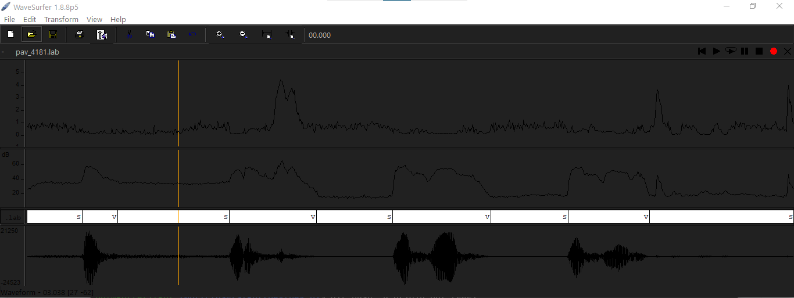
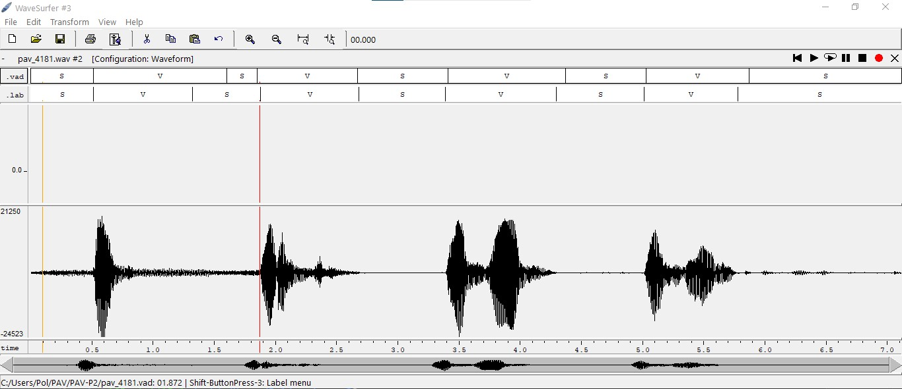
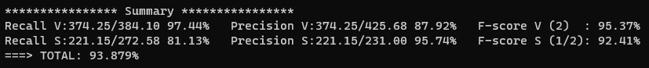

PAV - P2: detección de actividad vocal (VAD)
============================================

Esta práctica se distribuye a través del repositorio GitHub [Práctica 2](https://github.com/albino-pav/P2),
y una parte de su gestión se realizará mediante esta web de trabajo colaborativo.  Al contrario que Git,
GitHub se gestiona completamente desde un entorno gráfico bastante intuitivo. Además, está razonablemente
documentado, tanto internamente, mediante sus [Guías de GitHub](https://guides.github.com/), como
externamente, mediante infinidad de tutoriales, guías y vídeos disponibles gratuitamente en internet.


Inicialización del repositorio de la práctica.
----------------------------------------------

Para cargar los ficheros en su ordenador personal debe seguir los pasos siguientes:

*	Abra una cuenta GitHub para gestionar esta y el resto de prácticas del curso.
*	Cree un repositorio GitHub con el contenido inicial de la práctica (sólo debe hacerlo uno de los
	integrantes del grupo de laboratorio, cuya página GitHub actuará de repositorio central del grupo):
	-	Acceda la página de la [Práctica 2](https://github.com/albino-pav/P2).
	-	En la parte superior derecha encontrará el botón **`Fork`**. Apriételo y, después de unos segundos,
		se creará en su cuenta GitHub un proyecto con el mismo nombre (**P2**). Si ya tuviera uno con ese 
		nombre, se utilizará el nombre **P2-1**, y así sucesivamente.
*	Habilite al resto de miembros del grupo como *colaboradores* del proyecto; de este modo, podrán
	subir sus modificaciones al repositorio central:
	-	En la página principal del repositorio, en la pestaña **:gear:`Settings`**, escoja la opción 
		**Collaborators** y añada a su compañero de prácticas.
	-	Éste recibirá un email solicitándole confirmación. Una vez confirmado, tanto él como el
		propietario podrán gestionar el repositorio, por ejemplo: crear ramas en él o subir las
		modificaciones de su directorio local de trabajo al repositorio GitHub.
*	En la página principal del repositorio, localice el botón **Branch: master** y úselo para crear
	una rama nueva con los primeros apellidos de los integrantes del equipo de prácticas separados por
	guion (**fulano-mengano**).
*	Todos los miembros del grupo deben realizar su copia local en su ordenador personal.
	-	Copie la dirección de su copia del repositorio apretando en el botón **Clone or download**.
		Asegúrese de usar *Clone with HTTPS*.
	-	Abra una sesión de Bash en su ordenador personal y vaya al directorio **PAV**. Desde ahí, ejecute:

		```.sh
		git clone dirección-del-fork-de-la-práctica
		```

	-	Vaya al directorio de la práctica `cd P2`.
	-	Añada la etiqueta `origin` a su copia del repositorio. Esto es útil para facilitar los *push* y
		*pull* al repositorio original:
		```.sh
		git remote add origin dirección-del-fork-de-la-práctica
		```
	-	Cambie a la rama **fulano-mengano** con la orden:

		```.sh
		git checkout fulano-mengano
		```

*	A partir de este momento, todos los miembros del grupo de prácticas pueden trabajar en su directorio
	local del modo habitual.
	-	También puede utilizar el repositorio remoto como repositorio central para el trabajo colaborativo
		de los distintos miembros del grupo de prácticas; o puede serle útil usarlo como copia de
		seguridad.
	-	Cada vez que quiera subir sus cambios locales al repositorio GitHub deberá confirmar los
		cambios en su directorio local:

		```.sh
		git add .
		git commit -m "Mensaje del commit"
		```

		y, a continuación, subirlos con la orden:

		```.sh
		git push -u origin fulano-mengano
		```

*	Al final de la práctica, la rama **fulano-mengano** del repositorio GitHub servirá para remitir la
	práctica para su evaluación utilizando el mecanismo *pull request*.
	-	Vaya a la página principal de la copia del repositorio y asegúrese de estar en la rama
		**fulano-mengano**.
	-	Pulse en el botón **New pull request**, y siga las instrucciones de GitHub.


Entrega de la práctica.
-----------------------

Responda, en este mismo documento (README.md), los ejercicios indicados a continuación. Este documento es
un fichero de texto escrito con un formato denominado _**markdown**_. La principal característica de este
formato es que, manteniendo la legibilidad cuando se visualiza con herramientas en modo texto (`more`,
`less`, editores varios, ...), permite amplias posibilidades de visualización con formato en una amplia
gama de aplicaciones; muy notablemente, **GitHub**, **Doxygen** y **Facebook** (ciertamente, :eyes:).

En GitHub. cuando existe un fichero denominado README.md en el directorio raíz de un repositorio, se
interpreta y muestra al entrar en el repositorio.

Debe redactar las respuestas a los ejercicios usando Markdown. Puede encontrar información acerca de su
sintáxis en la página web [Sintaxis de Markdown](https://daringfireball.net/projects/markdown/syntax).
También puede consultar el documento adjunto [MARKDOWN.md](MARKDOWN.md), en el que se enumeran los
elementos más relevantes para completar la redacción de esta práctica.

Recuerde realizar el *pull request* una vez completada la práctica.

Ejercicios
----------

### Etiquetado manual de los segmentos de voz y silencio

- Etiquete manualmente los segmentos de voz y silencio del fichero grabado al efecto. Inserte, a 
  continuación, una captura de `wavesurfer` en la que se vea con claridad la señal temporal, el contorno de
  potencia y la tasa de cruces por cero, junto con el etiquetado manual de los segmentos.

	

- A la vista de la gráfica, indique qué valores considera adecuados para las magnitudes siguientes:


	* Incremento del nivel potencia en dB, respecto al nivel correspondiente al silencio inicial, para
	  estar seguros de que un segmento de señal se corresponde con voz.
	  
	  	```.sh
		Nivel de potencia: -52.089485 dBs.
		```
		
	* Duración mínima razonable de los segmentos de voz y silencio.
	
		```.sh
		Duración mínima Voz: 200 ms.
		Duración mínima Silencio: 50 ms.
		```

	* ¿Es capaz de sacar alguna conclusión a partir de la evolución de la tasa de cruces por cero?
		
		
	A partir de la evolución de cruces por cero, podemos observar que esta se comporta en función de la frecuencia. Y por ello se puede comprobar que cuando el 			sonido es fricativo, aumenta la frecuencia y por tanto la tasa de cruces por cero también lo hace. Asimismo sucede lo mismo a la inversa con los sonidos sonoros. 		Al haber un sonido sonoro, como la frecuencia queda considerablemente disminuida, la tasa de cruces por cero disminuye. En el caso de no tener sonido vemos que la 		tasa de cruces por cero se queda en un punto medio entre los dos anteriores casos. 
		

### Desarrollo del detector de actividad vocal

- Complete el código de los ficheros de la práctica para implementar un detector de actividad vocal tan
  exacto como sea posible. Tome como objetivo la maximización de la puntuación-F `TOTAL`.
	
### Código del fichero **vad.c**


#### Creación de Constantes y Umbrales
		
		const float FRAME_TIME = 10.0F; /* in ms. */
		const int TRAMAS_VOZ_NO_DECIDIDAS = 1;     	// Número de TRAMAS de MAYBE_VOICE MÁXIMAS
		const int TRAMAS_SILENCIO_NO_DECIDIDAS = 11;	// Número de TRAMAS de MAYBE_SILENCE MÁXIMAS
		const int N_INICIAL = 13;			// Número de ITERACIONES para el CÁLCULO de UMBRAL k0
		const float UMBRAL_K0 = 0.9;			// Umbral para la POTENCIA
		const float UMBRAL_K1 = 4.72;			// Umbral para la Potencia en caso de MAYBE_VOICE o MAYBE_SILENCE
		

#### Cálculo de Potencia, ZCR y Amplitud Media
		
Para realizar el cálculo de la potencia, ZCR y amplitud media hacemos uso de las funciones creadas en la práctica anterior, pasando los parámetros que estas necesitan. La función ‘ Features compute_features ’ Nos guarda los valores calculados de Potencia, ZCR y Amplitud Media en la variable feat y devuelve dicha variable. 
		
		Features compute_features(const float *x, int N) {
		
 		Features feat;
  		feat.p = compute_power(x,N);
  		feat.am = compute_am(x, N);
  		feat.zcr = compute_zcr(x, N, N/(FRAME_TIME*1e-03)); 
  		return feat;
  
		}
		
#### Abrimos el fichero
		
El siguiente código es el que permite abrir el fichero, asimismo permite declarar sus variables. A continuación se realiza una breve explicación de algunas de las variables:

ko es el umbral de potencia es decir que si la potencia está por encima de dicho valor o por debajo podremos decir si la trama es voz o silencio. 

last_change nos indica el valor de la posición de la última trama no indefinida es decir con valor de V (voz) o S (silencio).

frame nos indica la posición de la trama en la que estamos en ese momento. 

last_state nos indica el valor del último estado no indefinido, es decir indica si era V (Voz) o S (Silencio).

		
		VAD_DATA * vad_open(float rate) {
		
  		VAD_DATA *vad_data = malloc(sizeof(VAD_DATA));
  		vad_data->state = ST_INIT;                           
  		vad_data->sampling_rate = rate;                       
  		vad_data->frame_length = rate * FRAME_TIME * 1e-3;
  		vad_data->ko = 0;                                     //Umbral POTENCIA
  		vad_data->last_change = 0;                            //Indica ULTIMA TRAMA con V o S
  		vad_data->frame = 0;                                  //Número de TRAMA actual
  		vad_data->last_state = ST_INIT;                       //Indica ULTIMO ESTADO (V o S)
  		return vad_data;
		

#### Cerramos el fichero 
		
Al cerrar el fichero, nos ponemos en el último estado ya que normalmente la última trama será el mismo estado que justo el anterior. 

		
		VAD_STATE vad_close(VAD_DATA *vad_data) {
		
  		VAD_STATE state = vad_data->last_state; 
  		free(vad_data);
  		return state;
		}
		

#### Máquina de Estados FSA 
		
La máquina de estados es la que dice de qué tipo de trama se trata y funciona de la siguiente forma. Primero se mira la trama anterior a la que se va a tratar, y se guarda el valor que tiene (S o V). Así si luego hay que mirarla tenemos almacenado su valor. 
A continuación, miramos el número de estado en el que está la trama que hemos de tratar. 
Si se encuentra en el estado inicial (ST_INIT), calculamos la potencia que tiene y ponemos un valor al umbral (ko). Pasamos dicho valor a dBs y le ponemos a la trama el valor de que quizás podría ser silencio (ST_MAYBE_SILENCE). 
Si dicha trama se encuentra en estado de silencio (ST_SILENCE), miramos si la potencia de dicha trama está por encima del umbral ko o por debajo. Si está por encima, se le pone el estado de que quizás es voz (ST_MAYBE_VOICE) y al estado anterior le ponemos silencio (ST_SILENCE).
Si dicha trama se encuentra en estado de voz (ST_VOICE), miramos si la potencia de dicha trama está por encima del umbral ko o por debajo. Si está por debajo, se le pone el estado de que quizás es voz (ST_MAYBE_SILENCE) y al estado anterior le ponemos silencio (ST_VOICE).
Si dicha trama se encuentra en un estado de quizás silencio (ST_MAYBE_SILENCE)si la potencia está por encima del umbral ko se le cambia el estado a voz (ST_VOICE). En otros casos se le cambia el estado a silencio (ST_SILENCE). 
Si dicha trama se encuentra en estado de quizás voz (ST_MAYBE_VOICE), se hace lo mismo que con la trama de quizás silencio pero a la inversa. Si la potencia está por debajo del umbral se le pone el estado de silencio (ST_SILENCE), y en otros casos se le cambia el estado a voz (ST_VOICE). 
A continuación, se mira si el estado de la trama está definido o es el estado inicial. Si está definido como voz o silencio, la función devuelve el valor de dicho estado. Si el estado está definido como estado inicial, la función devuelve el valor de ST_SILENCE. Y si el estado es indefinido, la función devuelve el valor de ST_UNDEF.

	
		VAD_STATE vad(VAD_DATA *vad_data, float *x) {
		
		Features f = compute_features(x, vad_data->frame_length);
  		vad_data->last_feature = f.p; /* save feature, in case you want to show */
 		
		switch (vad_data->state) {

    		case ST_INIT:                                                           //CÁLCULO DEL UMBRAL DE POTENCIA
    		if (vad_data->frame<N_INICIAL){
        	vad_data->ko += pow(10, f.p/10);                                    //CALCULAMOS UMBRAL EN ESCALA LINEAL
       
   		 }else{

        	vad_data->ko = 10*log10(vad_data->ko/N_INICIAL) * UMBRAL_K0;        //CONVERTIMOS a dB
        	vad_data->state = ST_MAYBE_SILENCE;
    		}
    		break;
    

  		case ST_SILENCE:
   		 if (f.p > vad_data->ko)

   		 vad_data->state = ST_MAYBE_VOICE;
   		 vad_data->last_state = ST_SILENCE; 
    		vad_data->last_change = vad_data->frame;
    
   		 break;

  		case ST_VOICE:
	    	if (f.p < vad_data->ko)

    		vad_data->state = ST_MAYBE_SILENCE;
    		vad_data->last_state = ST_VOICE;
    		vad_data->last_change = vad_data->frame;
    
    
   		 break;
	
 		 case ST_MAYBE_SILENCE:

    		if(f.p > vad_data->ko + UMBRAL_K1){ 
     		 vad_data->state = ST_VOICE;
    		}
    		else if ((vad_data->frame - vad_data->last_change) == TRAMAS_SILENCIO_NO_DECIDIDAS){
     		 vad_data->state = ST_SILENCE;
   		 }
   		 break;

  		case ST_MAYBE_VOICE:

    		if(f.p < vad_data->ko + UMBRAL_K1){
     		 vad_data->state = ST_SILENCE;
    		}
    		else if ((vad_data->frame - vad_data->last_change) == TRAMAS_VOZ_NO_DECIDIDAS){
     		 vad_data->state = ST_VOICE;
   		 }
    		break;
  
 		 }
  
  		vad_data->frame++;

  		if (vad_data->state == ST_SILENCE || vad_data->state == ST_VOICE)
    		return vad_data->state;
  		else if (vad_data->state == ST_INIT)
   		 return ST_SILENCE;
  		else
   		 return ST_UNDEF;

		}

### Código del fichero **vad.h**
		
		typedef struct {
  		VAD_STATE state;
  		VAD_STATE last_state;
  		float sampling_rate;
  		unsigned int frame_length;
  		float last_feature; /* for debuggin purposes */
  		float ko;
  		int frame;
  		int last_change;

		} VAD_DATA;	

		
 
- Inserte una gráfica en la que se vea con claridad la señal temporal, el etiquetado manual y la detección
  automática conseguida para el fichero grabado al efecto. 

	
	

- Explique, si existen. las discrepancias entre el etiquetado manual y la detección automática.

Tal como se puede ver en la gráfica, existen discrepancias entre el etiquetado manual (el .lab) y la detección automática (el .vad), ya que la detección automática se basa en un umbral de decisión que no se adapta al tipo de voz. Por lo que si la señal pasa un poco del umbral a causa del ruido ambiente, ya lo detecta como voz. Podemos ver como el etiquetado manual y automático coinciden en muchas de las tramas, hay una parte donde el **vad** confunde un silencio con un sonido sordo, pero referente a las demás partes el autómata acierta casi a la perfección.

- Evalúe los resultados sobre la base de datos `db.v4` con el script `vad_evaluation.pl` e inserte a 
  continuación las tasas de sensibilidad (*recall*) y precisión para el conjunto de la base de datos (sólo
  el resumen).
  
 	
	
Tal como se puede apreciar en la imagen, el resultado obtenido es bastante bueno, ya que nos indica que tenemos un nivel de acierto superior al 93,87%. Por lo que menos de un 6% de las tramas han sido mal detectadas.
	
### Trabajos de ampliación

#### Cancelación del ruido en los segmentos de silencio

- Si ha desarrollado el algoritmo para la cancelación de los segmentos de silencio, inserte una gráfica en
  la que se vea con claridad la señal antes y después de la cancelación (puede que `wavesurfer` no sea la
  mejor opción para esto, ya que no es capaz de visualizar varias señales al mismo tiempo).

#### Gestión de las opciones del programa usando `docopt_c`

- Si ha usado `docopt_c` para realizar la gestión de las opciones y argumentos del programa `vad`, inserte
  una captura de pantalla en la que se vea el mensaje de ayuda del programa.


### Contribuciones adicionales y/o comentarios acerca de la práctica

- Indique a continuación si ha realizado algún tipo de aportación suplementaria (algoritmos de detección o 
  parámetros alternativos, etc.).

- Si lo desea, puede realizar también algún comentario acerca de la realización de la práctica que
  considere de interés de cara a su evaluación.


### Antes de entregar la práctica

Recuerde comprobar que el repositorio cuenta con los códigos correctos y en condiciones de ser 
correctamente compilados con la orden `meson bin; ninja -C bin`. El programa generado (`bin/vad`) será
el usado, sin más opciones, para realizar la evaluación *ciega* del sistema.
